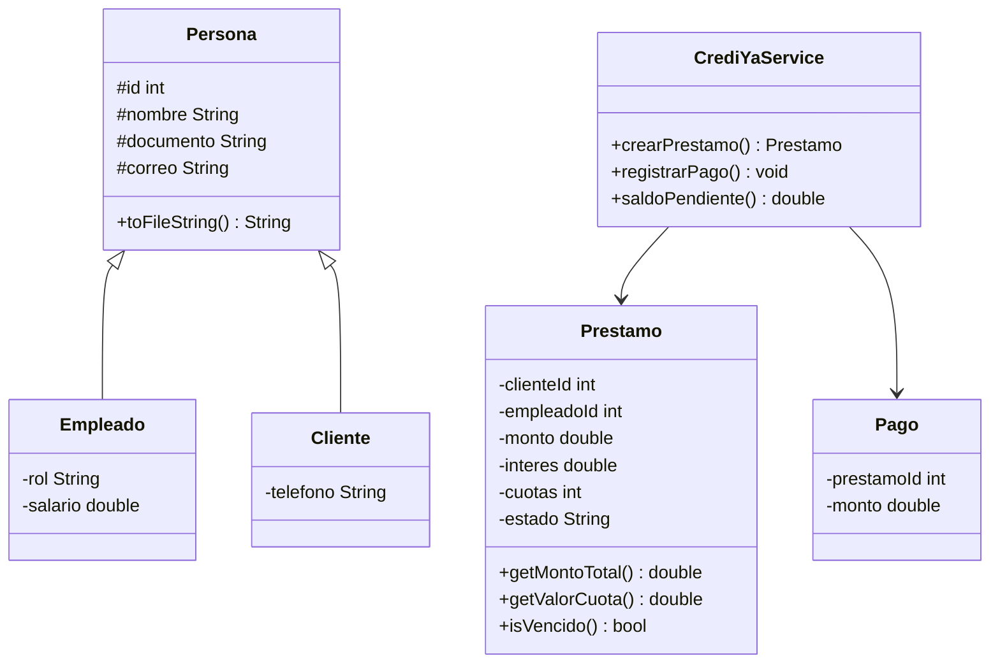

# UML CrediYa - vista previa rápida
> Abre este archivo y pulsa `Ctrl+Shift+V` en VS Code para ver el diagrama.

```mermaid
classDiagram
  class Persona{
    #id int
    #nombre String
    #documento String
    #correo String
    +toFileString() String
  }
  class Empleado{
    -rol String
    -salario double
  }
  class Cliente{
    -telefono String
  }
  class Prestamo{
    -clienteId int
    -empleadoId int
    -monto double
    -interes double
    -cuotas int
    -estado String
    +getMontoTotal() double
    +getValorCuota() double
    +isVencido() bool
  }
  class Pago{
    -prestamoId int
    -monto double
  }
  class CrediYaService{
    +crearPrestamo() Prestamo
    +registrarPago() void
    +saldoPendiente() double
  }
  Persona <|-- Empleado
  Persona <|-- Cliente
  CrediYaService --> Prestamo
  CrediYaService --> Pago
```
